# How to deploy web apps to AWS using S3 & CloudFront

## What is CloudFront:
> CloudFront is a Content Delivery Service that delivers content, yes who could have put those two together, such as videos, pictures, or applications to users. CloudFront will cache content to AWS Edge locations, providing faster retrieval time for users after the first initial retrieval. CloudFront is a global service and provides access to the backbone of the AWS network so that content is more easily served globally. For more information click the link AWS CloudFront.

## What is S3:
> Amazon S3 (Simple Storage Service) provides object storage, which is built for storing and recovering any amount of information or data from anywhere over the internet. It provides this storage through a web services interface. While designed for developers for easier web-scale computing, it provides 99.999999999 percent durability and 99.99 percent availability of objects. It can also store computer files up to 5 terabytes in size.
> 
> Apart from data storage functionality, the AWS S3 bucket provides a remarkable feature of static website hosting over it. A website that doesn’t involve server-side communication is called a static website.

## Purpose:
> To provision, one S3 bucket with a Text script in it, and have CloudFront serve our content by using this bucket as the origin. CloudFront will use Edge Locations thus reducing latency for our users.

## Requirements:
 - AWS account
 - Some Basic Experience with S3
 - Some Basic Experience with CloudFront

### Let’s start

Login into your AWS account, head over to the search bar at the top and search for S3.

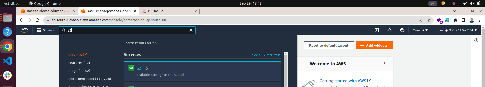

Inside of the S3 dashboard, click on “Create bucket”.
 
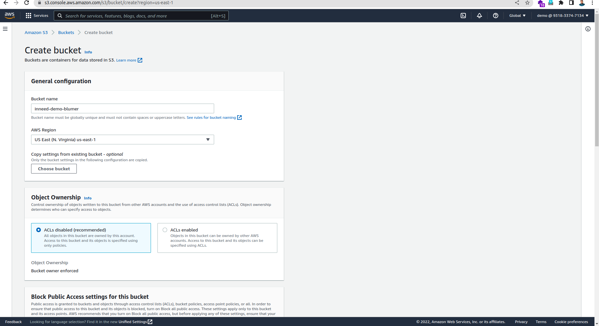

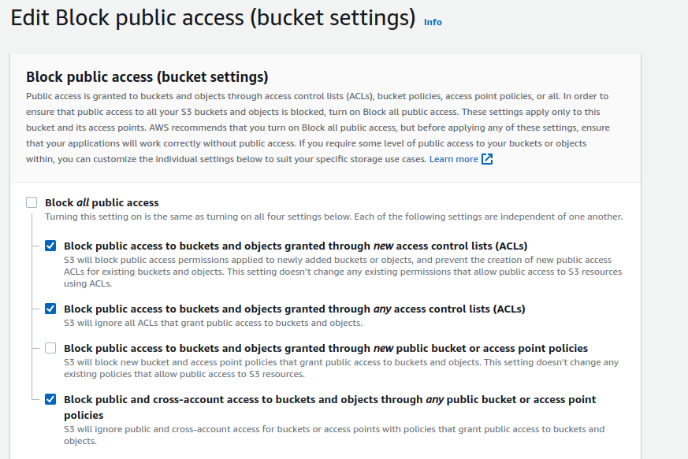
 
Scroll to the bottom and click “Create bucket”.

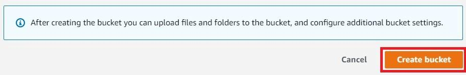
 
After creating the bucket, upload your website to the bucket by clicking on the bucket name. Once inside of your bucket on the “Objects” tab, click on the “Upload” button.

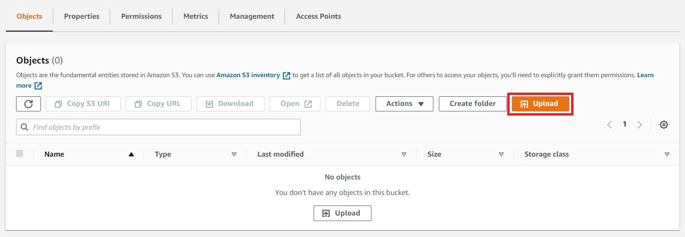

From here you can upload your files multiple ways. You can click “Add files”, “Add folder” or drag and drop your items. Once you’re done click “Upload”.

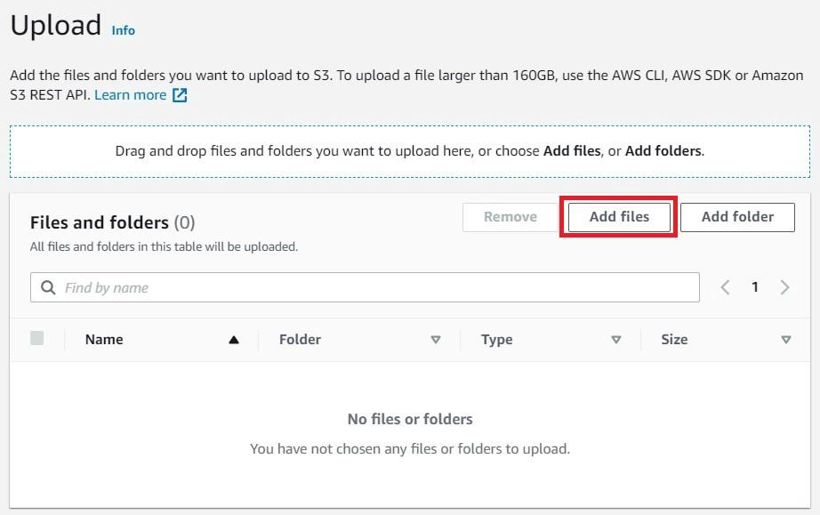

> NB: Now go to the local code repository and run “npm run build” 

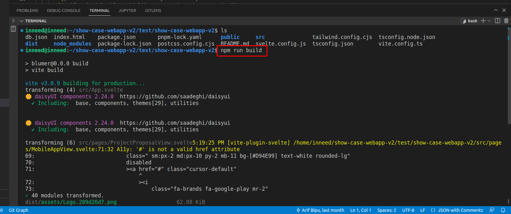

And upload the files from ./dist directory.

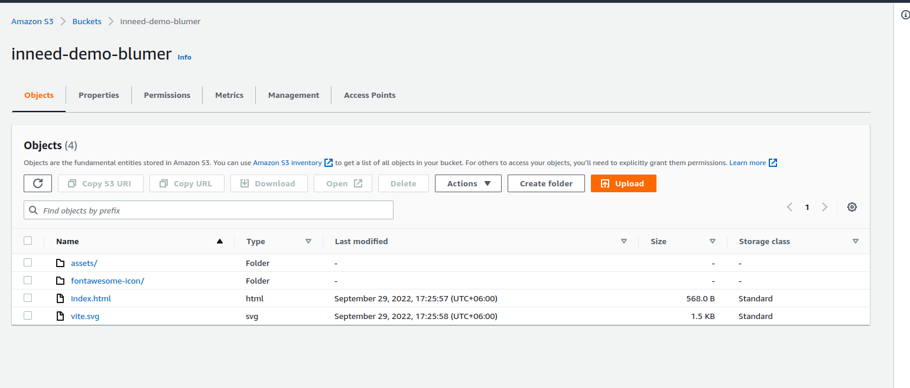

The next step is to grant permissions to your bucket so that this page is accessible by everyone.

To do that, head over to the “Permissions” tab of your bucket. Scroll down to the “Bucket policy” section and click on the “Edit” button.

Paste the below code from below link into the bucket policy:  

To Setup a CloudFront distribution go to “CloudFront” from the AWS console and follow these steps:

1. Click “Create distribution” and choose  or enter your origin's domain name.Set the origin domain name to be the newly created s3 bucket.

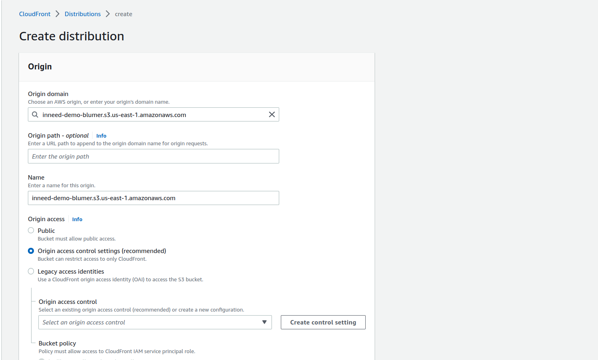

2. Set the default root object to index.html so it redirects / to /index.html

3. Choose origin access and select Origin access control settings (recommended) and update the s3 bucket policy. 

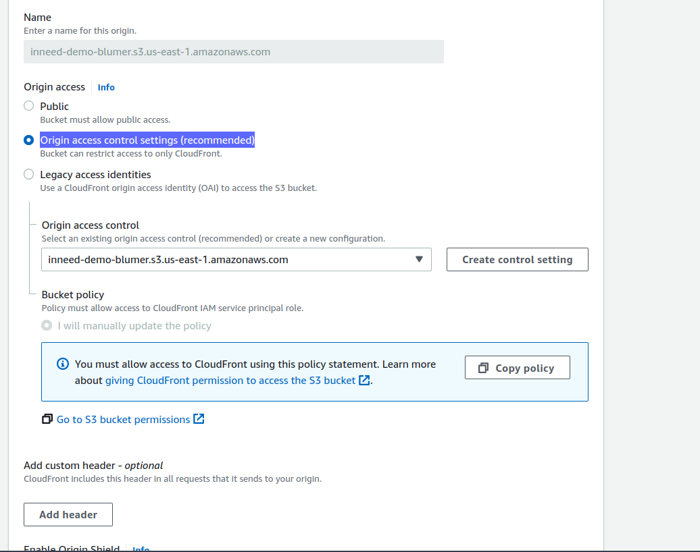

Click Create Distribution and wait until the distribution is created.

Now let’s create invalidation under the “invalidation” section. 

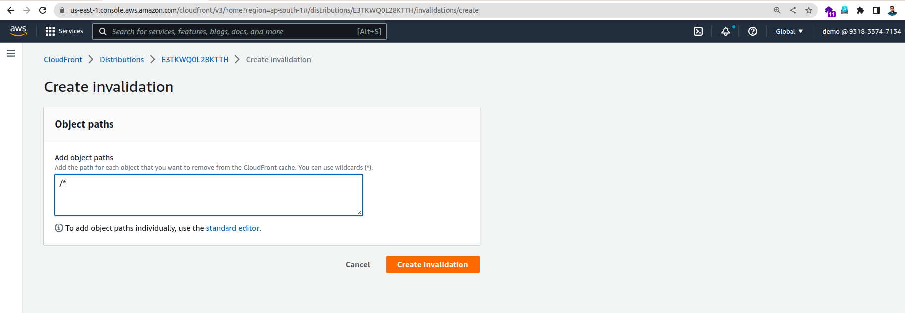

Now,your website should be now accessible via the CloudFront distribution’s URL. 

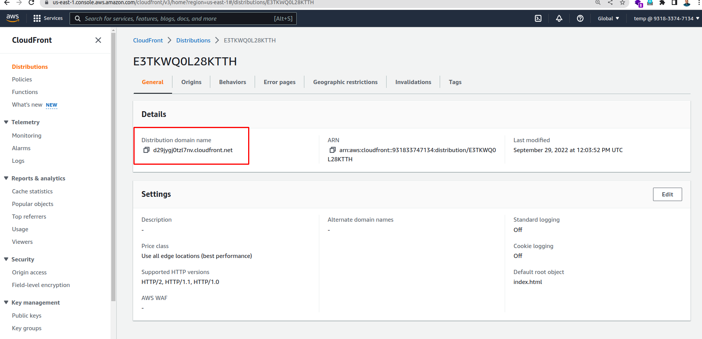

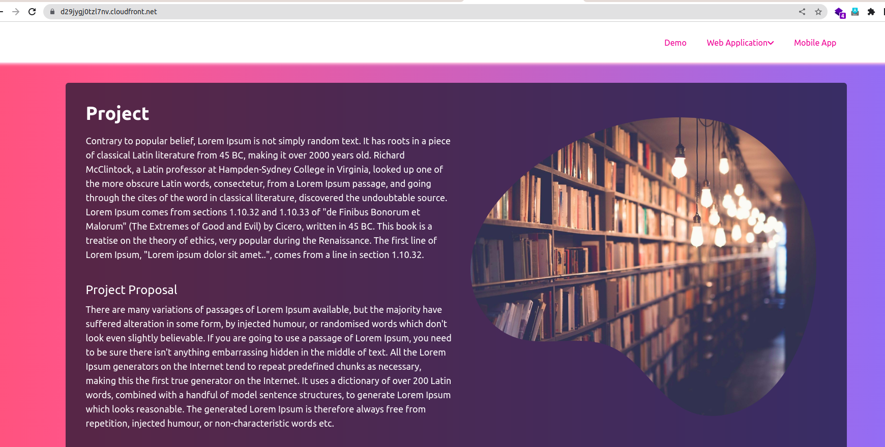
