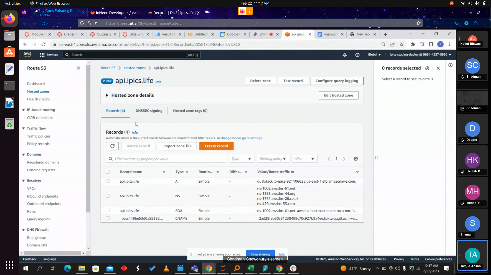
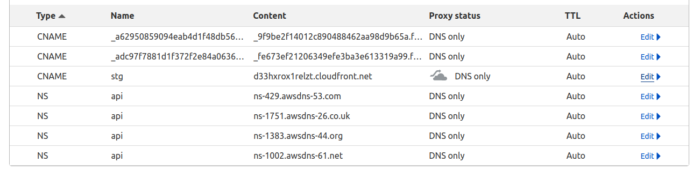
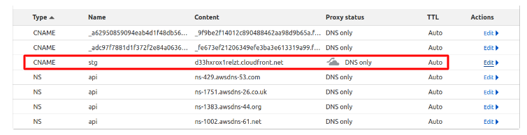

# Cloudflare DNS Configuration for api.ipics.life

To configure Cloudflare DNS, follow these steps:

1. Sign up for a Cloudflare account: If you don't already have a Cloudflare account, you will need to sign up for one. Go to https://www.cloudflare.com/ and click "Sign Up" in the top right corner of the page. Follow the instructions to create your account.

2. Add your domain: Once you have a Cloudflare account, click the "Add Site" button in your Cloudflare dashboard. Enter your domain name and click "Add Site". Cloudflare will scan your DNS records and import them.

3. Update your nameservers: Cloudflare will provide you with two nameservers. Go to your domain registrar's website and update your domain's nameservers to the ones provided by Cloudflare.

4. Review DNS settings: In your Cloudflare dashboard, go to the "DNS" tab. Here, you can review your DNS settings and make any necessary changes. You can add or delete DNS records, change the TTL (Time to Live), and more.

5. Enable Cloudflare features: Cloudflare offers many features that can improve your website's performance, security, and reliability. Go to the "Features" tab in your Cloudflare dashboard to explore these options. Some popular features include HTTPS/SSL encryption, caching, and DDoS protection.

6. Wait for DNS propagation: Once you have made changes to your DNS settings, it can take some time for those changes to propagate throughout the internet. This process can take up to 24 hours, although it is usually much faster.

That's it! By following these steps, you should be able to configure Cloudflare DNS for your domain.

## AWS Route 53 Configuration

First we need to go to AWS Route 53 console 

Then We need to create a Hosted zone for our domain.

After creating the hosted zone we will automatically get 4 ns records on our hosted zone. 

## Cloudflare NS Record Configuration

Now we need to create 4 ns records to our cloudflare sub-domain for api.ipics.life.

Then copy and paste the Route 53 ns records here.

## AWS Cloudfront Link configuration with Cloudflare sub-domain for static webapp serving

After deploying a static webapp on aws S3 and Cloudfront. We usually get a cloudfront distribution link. And We can get an ssl certificate from AWS ACM
as well. 

[stg.ipics.life](https://stg.ipics.life/)

Now we need to add a CNAME record on cloudflare 

