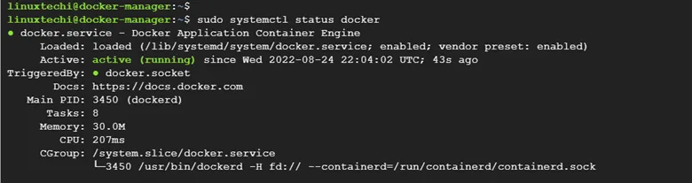
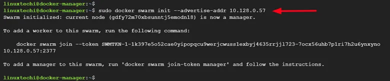
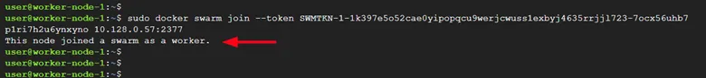
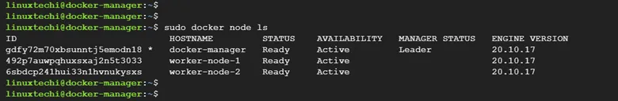
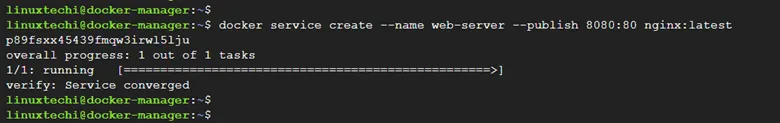
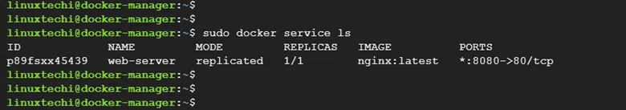
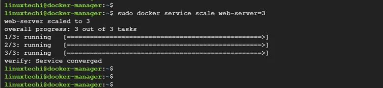
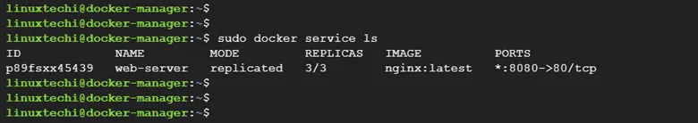
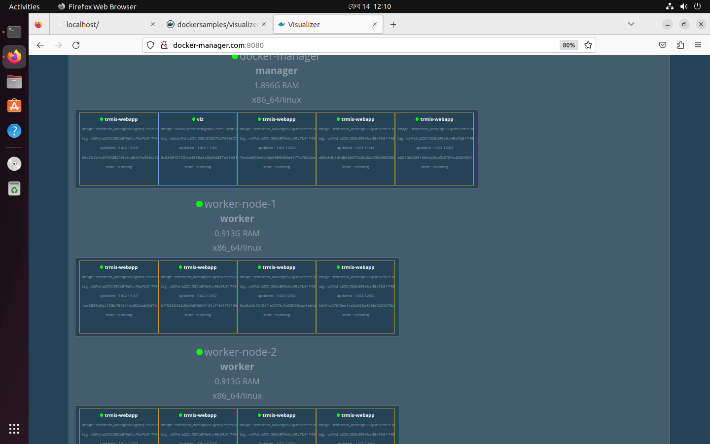

# Docker Swarm

by Kallol Biswas & Nazmul Islam (Swapan) - DevOps Engineer at InNeed Cloud

## What is Docker Swarm? 

> Docker Swarm is a native clustering solution for Docker that turns a group of Docker engines into a single virtual Docker engine. Docker Swarm provides native orchestration features, such as native service discovery, load balancing, scaling, and rolling updates, to manage the deployment and scaling of containerized applications.

## Why we use Docker Swarm?

> The primary reason to use Docker Swarm is to manage and orchestrate a large number of Docker containers, which can become complex and difficult to manage as the number of containers grows. With Docker Swarm, you can easily deploy and manage containers across a large number of hosts, automatically distribute load across multiple containers, and easily scale up or down as needed. This makes it easier to build, test, and deploy containerized applications in production environments, where reliability and scalability are critical. Additionally, Docker Swarm provides an easy-to-use, native interface for managing containers, which simplifies the deployment and management of complex, multi-container applications.

## Docker Swarm Lab Setup on server to deploy the application

> To demonstrate how Docker Swarm works, we have a simple cluster that comprises a Swarm Manager node and two worker nodes as shown. The Manager nodes handle all the cluster management tasks while the worker nodes will run the containers.

- docker-manager                   docker-manager-servcer-ip
- worker-node-1                    worker-node-1-ip
- worker-node-2                    worker-node-2-ip

### Step 1) Configure the Cluster hosts file

To start off, log into each of the nodes and update the /etc/hosts file with the following entries:

```
swarm-manager          docker-manager-servcer-ip
worker-node-1          worker-node-1-ip
worker-node-2          worker-node-2-ip
```
Next, ensure that all the nodes can ping each other. Therefore, on the manager node, run the commands:

```sh
ping -c 4 worker-node-1-ip
ping -c 4 worker-node-2-ip
```
On worker Node 1

```sh
ping -c 4 docker-manager-servcer-ip
ping -c 4 worker-node-2-ip
```
On worker Node 2

```sh
ping -c 4 swarm-manager-servcer-ip
ping -c 4 worker-node-1-ip
```

### Step 2) Install Docker CE on all the nodes

The next step is to install Docker on all the nodes. We are going to install Docker Community Edition (Docker CE) which is free to install and use.

Therefore, log into each of the nodes and update the local package index.


```sh
ssh -i "your-pem-key.pem" ubuntu@swarm-manager-server-ip

sudo apt update
```

Next, install the prerequisites package needed during the installation

```sh
sudo apt install apt-transport-https ca-certificates curl software-properties-common -y
```
Once all the packages have been installed, add the Docker GPG key

```sh
sudo curl -fsSL https://download.docker.com/linux/ubuntu/gpg | sudo gpg --dearmour -o /etc/apt/trusted.gpg.d/docker.gpg
```
In the next step, add the official Docker repository to your Ubuntu 22.04 system

```sh
sudo add-apt-repository "deb [arch=amd64] https://download.docker.com/linux/ubuntu $(lsb_release -cs) stable"
```
Next, update the local package index to make the system, aware of the newly added repository.

```sh
sudo apt update
```
Then install Docker from the official Docker repository,

```sh
sudo apt install docker-ce -y
```
The command installs Docker alongside additional packages that will be required by Docker to function as expected.

### Step 3) Verify Docker is running on all the nodes

Once installed, the Docker daemon starts automatically. You can verify that the service is running by running the command:

```sh
sudo systemctl status docker
```

Additionally, be sure to enable the Docker service so that it starts automatically on boot time.

```sh
sudo systemctl enable docker
```

### Step 4) Create Docker Swarm Cluster

The next step is to initialize the Docker Swarm on the Manager node. Once initialized, we will then add the worker nodes to the cluster.

To create a Docker Swarm Cluster, run the command:

```sh
sudo docker swarm init --advertise-addr swarm-manager-servcer-ip
```


Once Docker Swarm has been initialized, a command for joining the worker nodes to the cluster will be displayed on the terminal. Copy the command as you will need to run it on each of the worker nodes as previously mentioned.

Next, login back to each of the worker nodes and paste the command in order to join the cluster.

```sh
sudo docker swarm join --token SWMTKN-1-1k397e5o52cae0yipopqcu9werjcwuss1exbyj4635rrjjl723-7ocx56uhb7p1ri7h2u6ynxyno worker-node-1-ip
```
If all goes well, you should get the following output

Output

This node joined a swarm as a worker



Next, confirm that all the nodes have joined the cluster as follows.

```sh
sudo docker node ls
```
You should get the following output displaying all the nodes in the cluster.



### Step 5) Test Docker Swarm Installation

To test docker swarm installation, head over to the manager node and deploy a container application to the cluster. In this example, we are deploying an Nginx web server container and mapping it to port 80 on the host.

```sh
sudo docker service create --name trmis-webapp --publish 80:80 kallolinneed/frontend_webapp:v2
```


Next, verify the status of the application service deployed.

```sh
sudo docker service ls
```


### Step 6) Create replicas of the service

Finally, create ten replicas of the service and scale them across both the Docker manager and the worker nodes.

```sh
sudo docker service scale trmis-webapp=10
```


Next, confirm the status of the replicas. This time around, you will notice that we have 3 replicas.



At this point, Nginx web server container should be running across all the nodes in the cluster on port 80. To confirm this, head over to your browser, and access the web server from all the nodes.

- http://docker-manager.com or http://192.168.10.135

- http://worker-node-1-ip

- http://worker-node-2-ip


### Step 7) Docker Swarm Visualizer

Demo container that displays Docker services running on a Docker Swarm in a diagram.

This works only with Docker swarm mode which was introduced in Docker 1.12. These instructions presume you are running on the master node and you already have a Swarm running.

Each node in the swarm will show all tasks running on it. When a service goes down it'll be removed. When a node goes down it won't, instead the circle at the top will turn red to indicate it went down. Tasks will be removed. Occasionally the Remote API will return incomplete data, for instance the node can be missing a name. The next time info for that node is pulled, the name will update.

```sh
  sudo docker service create \
  --name=viz \
  --publish=8080:8080/tcp \
  --constraint=node.role==manager \
  --mount=type=bind,src=/var/run/docker.sock,dst=/var/run/docker.sock \
  dockersamples/visualizer

```
> To varify docker swarm visualization hit docker-swarm-manager-node-ip:8080




### Extra Configuration files for our app

This is an nginx.conf file

```conf
# auto detects a good number of processes to run
worker_processes auto;

#Provides the configuration file context in which the directives that affect connection processing are specified.
events {
    # Sets the maximum number of simultaneous connections that can be opened by a worker process.
    worker_connections 8000;
    # Tells the worker to accept multiple connections at a time
    multi_accept on;
}


http {
    # what times to include
    include       /etc/nginx/mime.types;
    # what is the default one
    default_type  application/octet-stream;

    # Sets the path, format, and configuration for a buffered log write
    log_format compression '$remote_addr - $remote_user [$time_local] '
        '"$request" $status $upstream_addr '
        '"$http_referer" "$http_user_agent"';

    server {
        # listen on port 80
        listen 80;
        # save logs here
        access_log /var/log/nginx/access.log compression;

        # where the root here
        root /usr/share/nginx/html;
        # what file to server as index
        index index.html index.htm;

        location / {
            # First attempt to serve request as file, then
            # as directory, then fall back to redirecting to index.html
            try_files $uri $uri/ /index.html;
        }

        # Media: images, icons, video, audio, HTC
        location ~* \.(?:jpg|jpeg|gif|png|ico|cur|gz|svg|svgz|mp4|ogg|ogv|webm|htc)$ {
          expires 1M;
          access_log off;
          add_header Cache-Control "public";
        }

        # Javascript and CSS files
        location ~* \.(?:css|js)$ {
            try_files $uri =404;
            expires 1y;
            access_log off;
            add_header Cache-Control "public";
        }

        # Any route containing a file extension (e.g. /devicesfile.js)
        location ~ ^.+\..+$ {
            try_files $uri =404;
        }
    }
}
```

This is a Dockerfile for builing a custom image for our application

```Dockerfile
FROM node:lts-alpine3.16 as build

WORKDIR /app

RUN npm i -g pnpm

COPY package.json ./
COPY pnpm-lock.yaml ./
RUN pnpm i
COPY . ./
RUN pnpm build

FROM nginx:1.23-alpine
COPY nginx.conf /etc/nginx/nginx.conf

COPY --from=build /app/build /usr/share/nginx/html
EXPOSE 80
CMD ["nginx", "-g", "daemon off;"]

```

### Rolling Update 

```sh
sudo docker service create –name redis –replicas 3 redis:3.0.7

sudo docker ps

sudo docker service update – image redis:3.0.8 redis
```
Draining Nodes

```sh
sudo docker node update –availability drain worker1
```
Drain status prevents the nodes for receiving new tasks

### Horizontal scaling vs Vertical scaling  In Docker Container 


- Horizontal scaling :  When we are talking about increase the number of replicas ( we are increase the number of container )

```sh
sudo docker service scale [ service name ] =10
sudo docker service scale my_service-=10
```
- Vertical scaling: When we are talking about upgrading the service vertically it means we actually upgrading the resource in current service . We are increasing the number of CPUs on the server we are increasing RAM on the server we are increasing hard drive on the server .

### Zero Downtime Service Upgrade
 
 ```sh
 Sudo docker service update –image [image name] [version] [service name]
sudo docker service update –image nginx:1:15;12 web_server
sudo docker service ps web_server
```
- Update Container for change container Port 8080 to 9090
sudo docker service update –publish-rm 8080 –publish-add 9090:80 web_server

### Secrets
- Create Docker Service with Secrets
```sh
mkdir Secretsexample
cd Secretsexample
nano dbpass.txt
sudo docker secret create db_password dbpass.txt
sudo docker secret ls
sudo docker secret inspect [ secret name]
```

### Docker Secrets – PostgreSQL Service

Docker Secret for User_name  =  trmis_user
Docker Secret for Password     =  trmis_pass

```sh
sudo docker service create \
--name trmisdb \
--replicas 2 \
--constraint=node.role=manager \
--network trmisntw \
--secret trmis_pass \
--secret trmis_user \
-e POSTGRES_PASSWORD_FILE=/run/secrets/trmis_pass \
-e POSTGRES_USER_FILE=/run/secrets/trmis_user \
postgres:latest
```


