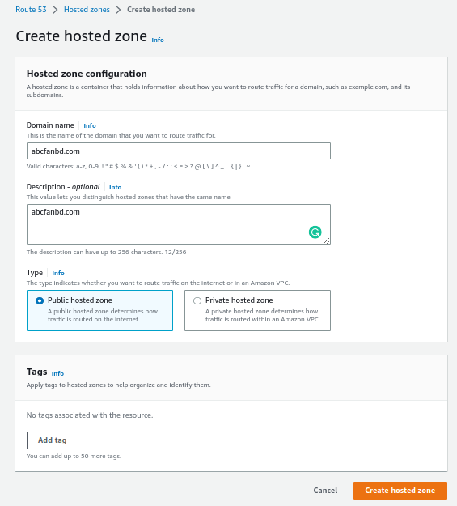
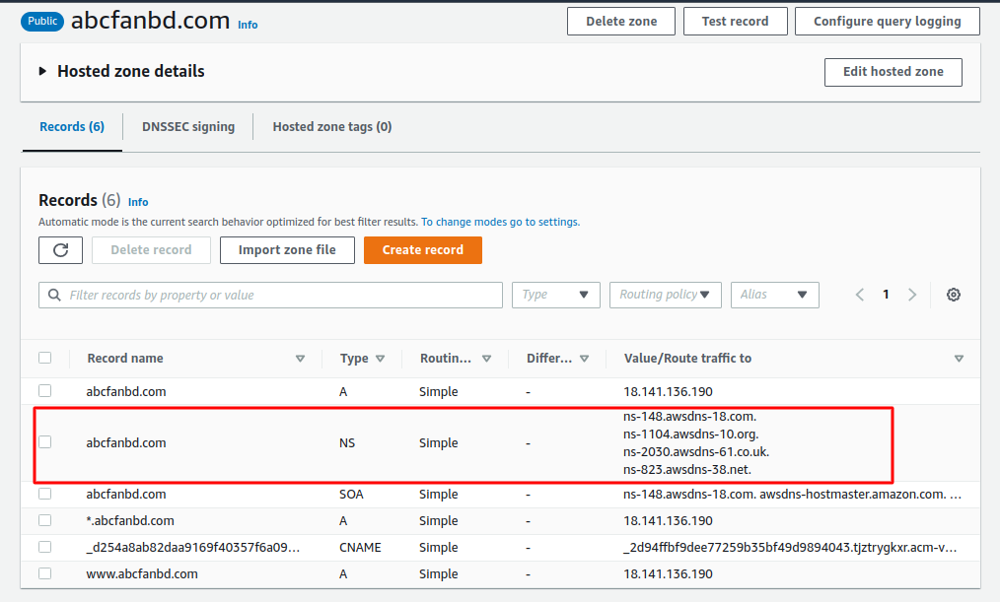
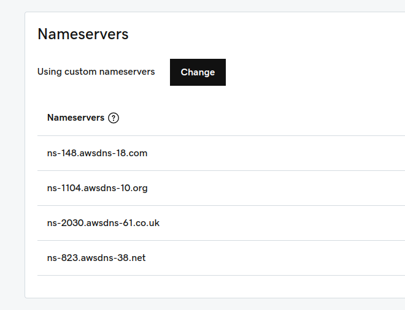
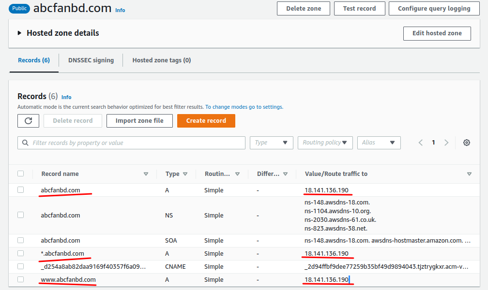

# Here we will deploy a php laravel webapp in a ubuntu server

## prerequisites - (git, php7.4, mysql-server, composer)

##	 Step 01: (Installing php7.4 on ubuntu 22.04)

```sh
	sudo apt update
	
	sudo apt install -y software-properties-common

	sudo add-apt-repository ppa:ondrej/php

	sudo apt update

	sudo apt install -y php7.4

	php -v  (To verify Installation)

	sudo apt install -y php7.4-{cli,common,curl,zip,gd,mysql,xml,mbstring,json,intl}
```

## Step 02: (Install Composer for dependency management)

```sh
	php -r "copy('https://getcomposer.org/installer', 'composer-setup.php');"
	php -r "if (hash_file('sha384', 'composer-setup.php') === '55ce33d7678c5a611085589f1f3ddf8b3c52d662cd01d4ba75c0ee0459970c2200a51f492d557530c71c15d8dba01eae') { echo 'Installer verified'; } else { echo 'Installer corrupt'; unlink('composer-setup.php'); } echo PHP_EOL;"
	php composer-setup.php
	php -r "unlink('composer-setup.php');"

	 php composer.phar --version

	 sudo mv composer.phar /usr/local/bin/composer

	 cd /usr/local/bin

	 sudo chmod u+x composer

     composer --version
```

##	 Step 03: (Installing Mysql-server and create demo database for project)

```sh
	sudo apt update

	sudo apt install -y mysql-server

	sudo systemctl status mysql

    sudo systemctl enable mysql
```

## Configuring MySQL

```sh
	sudo mysql

	ALTER USER 'root'@'localhost' IDENTIFIED WITH mysql_native_password BY 'your-password';

	exit

	mysql -u root -p

	create database your-database-name;
```
## Creating a Dedicated MySQL User and Granting Privileges (Optional)

```sh
	sudo mysql

	mysql -u root -p

	CREATE USER 'nazmul'@'localhost' IDENTIFIED BY 'your-password';

	GRANT PRIVILEGE ON database.table TO 'nazmul'@'host'; (or)

	GRANT ALL PRIVILEGES ON *.* TO 'nazmul'@'localhost' WITH GRANT OPTION;

	FLUSH PRIVILEGES;

	mysql> exit

	mysql -u nazmul -p
```
## Testing MySQL

```sh
	sudo systemctl status mysql

	sudo mysqladmin -p -u nazmul version
```

##	Step 04: (Cloning git repo to root directory)

```sh
	cd /var/www/html

	sudo git clone https://gitlab.com/niswapan/abcfan-website.git

	sudo mv abcfan-website abc

	sudo chown -R ubuntu:ubuntu /var/www/html/abc/*

	sudo chmod -R 777 /var/www/html/abc/*

	cd abc

	sudo cp .env.example .env
	
	sudo nano .env (change the database name as your created your-database-name and root user password)

	composer install
```

## Step 05: Configure web server 

```sh
	cd /etc/apache2/sites-enabled

	sudo nano 000-default.conf

	paste below texts and save & exit

	 ServerAdmin webmaster@localhost
         DocumentRoot /var/www/html/abc/public

         <Directory /var/www/html/abc/public>
                Options Indexes FollowSymLinks MultiViews
                AllowOverride All
                Order allow,deny
                allow from all
         </Directory>

	sudo a2enmod rewrite

	sudo systemctl restart apache2
```

## Step 06: Configure application

```sh
open your browser and hit your-server-ip

cd /var/www/html/abc/

php artisan key:generate

php artisan migrate

```
## Step 06: How to bind with your domain name

1. Goto Route53 on aws console and Create a hosted zone with your valid domain name in my case (abcfanbd.com)



2. Copy 4 NS records from aws route 53 hosted zone  
   

3. Paste on your domain provider dns nameserver. In my case its Godaddy.com



4. On your aws hosted zone add 3 more simple A record 



5. Finally Hit your domain abcfanbd.com


