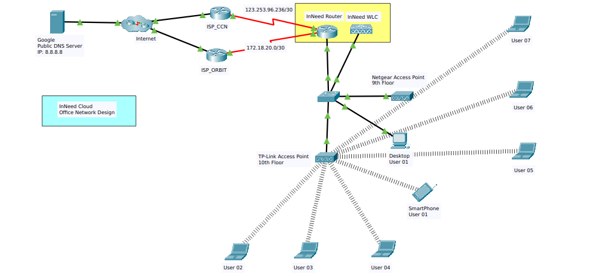
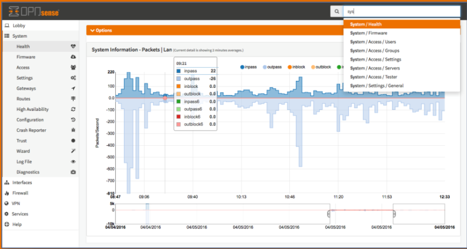

# Contributor
Nazmul Islam & 
Tanvir Ahmed

## InNeed Office Network Infrastructure

We designed InNeed office network through cisco packet tracer

Fig:01 (InNeed Office Network Design) Tools used (Cisco Packet Tracer 8.2)


## Hardware Lists:

1. Router (Custom Made) cum Firewall Device (Access IP: 192.168.1.1)
2. TP-Link 18 port Managed Switch (Access IP: 192.168.1.2)
3. Netgear Access Point directly connected to the Switch (Installed on 9th**
    **Floor) (Access IP: 192.168.1.3)
4. TP-Link Access Point directly connected to the Switch (Installed on 10th**
    **Floor) (Access IP: 192.168.1.4)
5. Some IP Cameras directly connected to TP-Link Switch through cable (Access IP: 192.168.1.20 - 192.168.1.24)
6. Some Cat5e (Ethernet) Cables.** 

## Software:

1. OPNsense for Router cum Firewall:


## Step 01: (Internet Connection from ISP)

We have 2 internet connections from 2 different ISP (Internet Service Provider).

- ISP 01 Details: 
CCN (Chomok Cable Network) - Our IP Address: (10.253.31.251)
Package: 
40 Mbps (Offpeak 2am - 8pm)
24 Mbps (Offpeak 8pm - 1:59am)
(Shared Bandwith)


- ISP 02 Details:
Orbit Internet IP (182.48.92.42)
Package: 
24 Mbps (Offpeak 2am - 8pm)
10 Mbps (Offpeak 8pm - 1:59am)
(Shared Bandwith)

## Step 02: (Core Layer - Router):

From both ISP’s fiberline’s Onu we connected to our Router cum WLC through ethernet
straight cable.

To manage the network configuration this device has the OPNsense OS.
We need towrite this ip address 192.168.1.1 to our browser and give credentials to
enter to the admin panel while connected to the InNeed.Cloud_Admin (SSID).
After login we can configure the router as our requirement.Here We created DCHP IP pool for each department and from the DHCP   
server to give automatic IP addresses to our hosts (End devices).

Fig:02 [OPNsense Admin panel]




## Step 03: (Distribution Layer - Switch):
In This step we connected our Router to the TP-Link Managed switch for creating our
LAN (Local Area Network) by another straight through cable.

From this switch we created some VLAN (Virtual Local Area Network) for our
departments such as - Admin, Management, Developers and Guests.
VLAN 10 for Admin and their sub-network is 192.168.10.0/28, VLAN 20 Management and their sub-network is 192.168.20.0/26, VLAN 30 for Developers and their sub-network is 192.168.30.0/25, VLAN 40 for
Guests and their sub-network is 192.168.40.0/26.

And then we connected our wireless access points to the TP-Link Managed switch for
WLAN (Wireless Local Area Network) to access our devices wirelessly to the internet.

And Also we connected some IP Cameras directly to the TP-Link Managed switch. IP Cameras access IP (192.168.1.20-192.168.1.24)

## Step 04: (Access Layer - Access Points):
All our access points have 4 SSID (WiFi) such as -
- InNeed.Cloud Admin 
- InNeed.Cloud Management
- InNeed.Cloud Developers
- InNeed.Cloud Guests

In this step we can connect our end devices to the WiFi through these access points.

```
Thanks & Regards
Nazmul Islam
Cloud DevOps Engineer
InNeed Cloud
```


